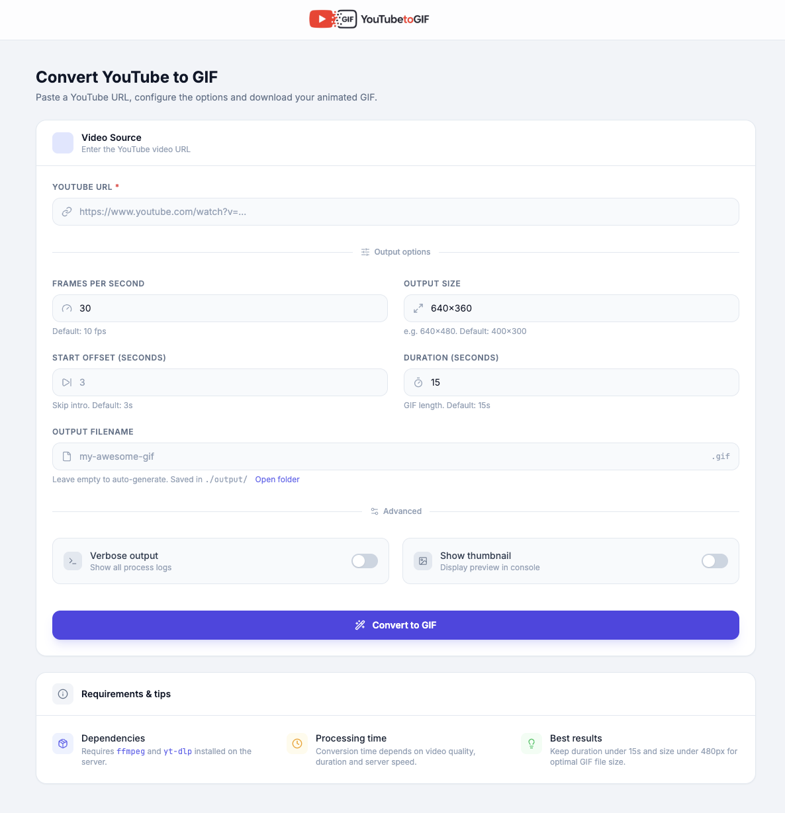

# YouTube to GIF


A web application to convert YouTube videos into animated GIFs — right from your browser. Paste a URL, configure the output options and download your GIF in seconds.



---

## Features

- **One-click conversion** — paste a YouTube URL and hit convert
- **Full option control** — FPS, dimensions, start offset, duration and output filename
- **Live log terminal** — real-time conversion output streamed via Server-Sent Events (SSE)
- **GIF preview** — inline preview and one-click download when done
- **Modern UI** — Tailwind CSS interface with dark/light mode toggle and smooth animations
- **Local HTTPS** — served at `https://youtube-to-gif.dev` via DDEV + mkcert (no port numbers)

---

## Tech stack

| Layer | Technology |
|---|---|
| Backend | Node.js + Express |
| Frontend | HTML + Tailwind CSS (CDN) + Vanilla JS |
| Icons | Lucide |
| Fonts | Inter + JetBrains Mono |
| Streaming | Server-Sent Events (SSE) |
| Local env | DDEV (Docker + Traefik + mkcert) |
| Conversion | yt-dlp + ffmpeg |

---

## Prerequisites

### System dependencies

Make sure the following tools are installed on your machine before running the app **outside** of DDEV:

```bash
# macOS (Homebrew)
brew install ffmpeg yt-dlp
```

> When using DDEV, `ffmpeg` and `yt-dlp` are installed automatically inside the container.

### Local environment

- [Node.js](https://nodejs.org/) 20+
- [DDEV](https://ddev.com/) 1.22+ *(recommended)*

---

## Getting started

### With DDEV (recommended)

DDEV handles Docker, HTTPS certificates (mkcert), DNS and all system dependencies automatically.

```bash
# 1. Clone the repository
git clone https://github.com/your-username/youtube-to-gif.git
cd youtube-to-gif

# 2. Start the project (will prompt for sudo to update /etc/hosts)
ddev start
```

The app will be available at:

| URL | Description |
|---|---|
| `https://youtube-to-gif.dev` | Custom local domain (HTTPS) |
| `https://youtube-to-gif.ddev.site` | DDEV default domain (HTTPS) |

> On first start, DDEV installs `ffmpeg`, `yt-dlp` and the Node.js dependencies inside the container. This may take a couple of minutes.

### Without DDEV (standalone)

```bash
# 1. Clone and install dependencies
git clone https://github.com/your-username/youtube-to-gif.git
cd youtube-to-gif
npm install

# 2. Start the server
npm start
```

The app will be available at `http://localhost:3000`.

---

## Conversion options

The UI exposes the conversion settings supported by the app:

| Option | Description | Default |
|---|---|---|
| **URL** | YouTube video URL | *(required)* |
| **FPS** | Frames per second of the output GIF | `30` |
| **Size** | Output dimensions (e.g. `640x360`) | `640x360` |
| **Start offset** | Skip the first N seconds of the video | `3` |
| **Duration** | Length of the GIF in seconds | `15` |
| **Output filename** | Custom name for the `.gif` file | auto-generated |
| **Verbose** | Show full process output in the log terminal | off |

Generated GIFs are saved to the `./output/` directory and served statically.

---

## Project structure

```
youtube-to-gif/
├── .ddev/
│   ├── config.yaml                  # DDEV project config (Node.js daemon, FQDN, packages)
│   └── nginx_full/
│       └── nginx-site.conf          # Nginx reverse proxy with SSE support
├── assets/
│   └── screenshot.png               # README screenshot
├── public/
│   ├── index.html                   # UI — Tailwind CSS, dark/light mode, form
│   └── app.js                       # Client-side logic — form handling, SSE, state
├── output/                          # Generated GIF files (git-ignored)
├── server.js                        # Express server — REST API + SSE streaming
└── package.json
```

---

## Architecture

```
Browser
  │
  ▼ HTTPS (youtube-to-gif.dev)
Traefik router          ← DDEV manages SSL cert via mkcert
  │
  ▼ HTTP :80
nginx (web container)   ← reverse proxy, SSE buffering disabled
  │
  ▼ HTTP :3000
Node.js / Express       ← REST API + static file serving
  │
  ▼ child_process.spawn
yt-dlp                  ← resolves the downloadable media URL
  │
  ▼
ffmpeg                  ← trims, scales and encodes the GIF
  │
  ▼
./output/*.gif         ← served statically at /output/*
```

---

## Development

```bash
# Start DDEV
ddev start

# Watch Node.js server logs
ddev exec "supervisorctl tail -f webextradaemons:node-server"

# Restart only the Node.js process (no full DDEV restart needed)
ddev exec "supervisorctl restart webextradaemons:node-server"

# Open a shell inside the web container
ddev ssh
```

---

## Notes

- The `.dev` TLD is HSTS-preloaded by browsers, so HTTPS is always enforced. DDEV + mkcert handles this transparently with a locally-trusted certificate.
- SSE streaming requires `proxy_buffering off` in nginx — this is already configured in `.ddev/nginx_full/nginx-site.conf`.
- Output GIFs are **not** git-tracked (`output/` is in `.gitignore`). Files are ephemeral and cleaned up after 10 minutes by the server.
- Some YouTube videos require authenticated cookies for `yt-dlp`. You can place a Netscape-format cookies file at `.ddev/yt-dlp-cookies.txt` or set `YT_DLP_COOKIES_FILE` to another path before starting the Node server.
- DDEV-generated Traefik certificates and private keys are intentionally not committed.

---

## Contributing

Pull requests are welcome. For major changes, please open an issue first to discuss what you would like to change.

1. Fork the repository
2. Create your feature branch (`git flow feature start my-feature`)
3. Commit your changes
4. Open a Pull Request

---

## License

[MIT](LICENSE)

---

## Acknowledgements

- [ffmpeg](https://ffmpeg.org/) — video processing
- [yt-dlp](https://github.com/yt-dlp/yt-dlp) — YouTube download engine
- [DDEV](https://ddev.com/) — local development environment
- [Tailwind CSS](https://tailwindcss.com/) — utility-first CSS framework
- [Lucide](https://lucide.dev/) — icon library
